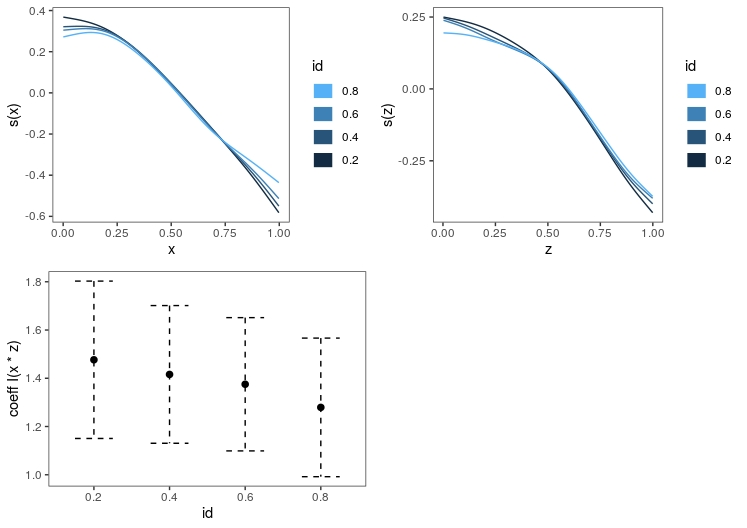

# Introduction to modern Generalized Additive Models in R (with mgcv)

<div style="text-align: justify">

Authors: [Matteo Fasiolo, University of Bristol](http://www.bristol.ac.uk/maths/people/matteo-fasiolo/overview.html)

**IMPORTANT** please see the "Preparing for the workshop" section below.

### Description

Generalized Additive Models (GAMs) models are a non-parametric extension of traditional regression models and have proved to be highly useful for both predictive and inferential purposes in a variety of scientific and commercial applications. One reason behind the popularity of GAMs is that they strike a balance between flexibility and interpretability, while being able to handle large data sets. The course will introduce standard GAM methods and software, as well as more recent developments such as quantile GAMs. The hands-on sessions will be based on the mgcv, qgam and mgcViz package, and will make sure that the attendees will be ready to start doing GAM modelling in R as soon as the course is over. 

To get the most out of this course, attendees are expected to have some on (linear) regression modelling, as well as a good understanding of fundamental statistical concepts such as probability densities, quantiles, etc. Some basic proficiency with R (eg. loading data, accessing data frames, basic use of the lm() function) is also assumed. 

Attendees will need to bring a laptop with a recent version of R installed. Prior to the course attendees will be asked to install some additional R packages.

### Bio

Matteo Fasiolo works as a research associate at the University of Bristol, where his position is funded by EPSRC and Électricité de France. His current research is concerned with extending Generalized Additive Models (GAMs), which are flexible non-parametric regression models, with particular focus on electricity demand forecasting applications. He is the author of the qgam R package, which provides fitting methods for quantile regression GAMs, and of the mgcViz package, which offers new ggplot2-based visualization tools for GAMs. Matteo has an MEng in Industrial Engineering from the University of Udine (Italy), an MSc in Financial Engineering from the University of London (Birkbeck College) and a PhD in Statistics from the University of Bath. For more info, see https://mfasiolo.github.io

### Preparing for the workshop

At least 50\% of the workshop will be hands-on, so you will need a working R environment, version 3.5 or above. 

On MAC you will also need to install XQuartz, which you can find at https://www.xquartz.org/.
                          
**NB: R version < 3.4.4 might not work, and R version < 3.4 will definitely not work!**

Having installed R, please install all the relevant packages before the course. You can do it by running the following code in R:

```r
install.packages("devtools")
library(devtools)
install_github("mfasiolo/mgcFam")  
install_github("mfasiolo/testGam") # mgcFam and testGam in this order
```

To test whether all is ok with your installation, run the following code in R. The call to `plotRGL` should open an interactive x11 window (On Mac it is important that you check that this works - please let me know if it doesn't). The call to `plot` should instead produce the image below.

```r
library(mgcViz)
set.seed(2) ## simulate some data...
dat <- gamSim(2,n=500,dist="normal",scale=0.25)$data

b <- qgamV(y ~ s(x, z), data = dat, qu = 0.5)

plotRGL(sm(b, 1), residuals = TRUE)

# Fit GAM and get gamViz object
b <- mqgamV(y~s(x) + s(z) + I(x*z), data = dat, qu = c(0.2, 0.4, 0.6, 0.8),
            aQgam = list(argGam = list(select = TRUE)), aViz = list("nsim" = 0))

# Either way, we plot all effects by doing
print(plot(b, allTerms = TRUE), pages = 1)
```



